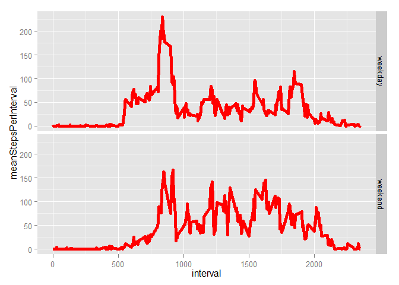

# Reproducible Research: Peer Assessment 1


## Loading and preprocessing the data

After forking the repo, there is a file called "activity.zip". This markdown document must be in the same folder and the working directory must be set to source file location. The following code will load the data and transform the data into the proper types (integer for the steps and interval, POSIXct for the date). 


```r
library(ggplot2)
library(dplyr)
library(lubridate)
unzip(zipfile = "activity.zip")
data <- read.table(file = "activity.csv", header = TRUE, sep = ",", na.strings = c("NA"), colClasses = c("integer", "Date", "integer"), )
data$date <- ymd(data$date)
```


## Mean total number of steps taken per day

### 1. Histogram of the total number of steps taken each day. 


```r
drawHistogramOfTotalNumberOfStepsPerDay <- function(data) {
    differentDates <- unique(data$date)
    numberOfDifferentDates <- length(differentDates)
    numberOfDifferentDates
    
    dataPerDate <- group_by(.data = data, date)
    
    sumPerDate <- summarise(.data = dataPerDate, totalStepsPerDay = sum(steps, na.rm = TRUE))
    sumPerDate <- filter(.data = sumPerDate, totalStepsPerDay != 0)
    sumPerDate
    
    plot <- ggplot() + geom_histogram(data = sumPerDate, aes(totalStepsPerDay)) 
    print(plot)
    
    return(sumPerDate)
}
sumPerDate <- drawHistogramOfTotalNumberOfStepsPerDay(data)
```

```
## stat_bin: binwidth defaulted to range/30. Use 'binwidth = x' to adjust this.
```

 


### 2. Mean and median of total number of steps per day


```r
meanTotalStepsPerDay <- mean(sumPerDate$totalStepsPerDay)
meanTotalStepsPerDay
```

```
## [1] 10766.19
```

```r
medianTotalStepsPerDay <- median(sumPerDate$totalStepsPerDay)
medianTotalStepsPerDay
```

```
## [1] 10765
```


## What is the average daily activity pattern?

### 1. 

Task: Make a time series plot (i.e. type = "l") of the 5-minute interval (x-axis) and the average number of steps taken, averaged across all days (y-axis)


```r
dataByInterval <- group_by(.data = data, interval)

meanPerInterval <- summarise(.data = dataByInterval, meanStepsPerInterval = mean(steps, na.rm = TRUE))
meanPerInterval
```

```
## Source: local data frame [288 x 2]
## 
##    interval meanStepsPerInterval
## 1         0            1.7169811
## 2         5            0.3396226
## 3        10            0.1320755
## 4        15            0.1509434
## 5        20            0.0754717
## 6        25            2.0943396
## 7        30            0.5283019
## 8        35            0.8679245
## 9        40            0.0000000
## 10       45            1.4716981
## ..      ...                  ...
```

```r
ggplot(data = meanPerInterval, aes(x = interval, y = meanStepsPerInterval)) + geom_line(size = 2, color = "red")
```

 


### 2. 

Task: Which 5-minute interval, on average across all the days in the dataset, contains the maximum number of steps?


```r
maxIntervalRow <- filter(meanPerInterval, meanStepsPerInterval == max(meanStepsPerInterval))
maxIntervalRow
```

```
## Source: local data frame [1 x 2]
## 
##   interval meanStepsPerInterval
## 1      835             206.1698
```
So the most active interval (mean across all days) is interval 835. 

## Imputing missing values

### 1. 

Task: Calculate and report the total number of missing values in the dataset (i.e. the total number of rows with NAs)

Missing values are only in the steps column of the dataset. When reading in the dataset, all character strings ("NA") were considered missing NA values. 


```r
sum(is.na(data$steps))
```

```
## [1] 2304
```

So there are 2304 missing values. 


### 2. 

Task: Devise a strategy for filling in all of the missing values in the dataset. The strategy does not need to be sophisticated. For example, you could use the mean/median for that day, or the mean for that 5-minute interval, etc.

Looking at the vector `is.na(data$steps)` (result not shown here), it seems that there are 4 big clusters of missing values, possibly connected to whole missing days. Quickly checking this hypothesis shows that there are 8 days missing (`length(unique(data[is.na(data$steps), ]$date))`). 

One option to deal with this problem is to take the average over all days for a missing interval. This will be done in the following. 


### 3. 
Task: Create a new dataset that is equal to the original dataset but with the missing data filled in.


```r
data2 <- data
for (i in 1:nrow(data2)) {
    if (is.na(data2$steps[i])) {
        tempInterval <- data2$interval[i]
        tempValue <- meanPerInterval[ meanPerInterval$interval == tempInterval , 2]
        # tempRow <- filter(meanPerInterval, meanStepsPerInterval == tempInterval) <-- doesn't work... why?
        # tempValue <- tempRow$meanStepsPerInterval[1]   
        data2$steps[i] <- as.numeric(tempValue) # convert list to single numeric value
    }
}
sum(is.na(data2$steps))
```

```
## [1] 0
```

This new dataset `data2` has 0 missing values. 


### 4. 

Task: Make a histogram of the total number of steps taken each day and Calculate and report the mean and median total number of steps taken per day. Do these values differ from the estimates from the first part of the assignment? What is the impact of imputing missing data on the estimates of the total daily number of steps?


```r
sumPerDate2 <- drawHistogramOfTotalNumberOfStepsPerDay(data2)
```

```
## stat_bin: binwidth defaulted to range/30. Use 'binwidth = x' to adjust this.
```

 

```r
meanTotalStepsPerDay2 <- mean(sumPerDate2$totalStepsPerDay)

medianTotalStepsPerDay2 <- median(sumPerDate2$totalStepsPerDay)

print(paste("mean 1", meanTotalStepsPerDay, "mean 2", meanTotalStepsPerDay2, 
                      "median 1", medianTotalStepsPerDay, "median 2", medianTotalStepsPerDay2, sep = " , "))
```

```
## [1] "mean 1 , 10766.1886792453 , mean 2 , 10766.1886792453 , median 1 , 10765 , median 2 , 10766.1886792453"
```

This shows that the mean was not changed at all upon filling in the missing values. The median, however, changed slightly. It is noted that the missing values were replaced using the _mean_ of the interval over all days. 


## Are there differences in activity patterns between weekdays and weekends?

### 1. 

Task: Create a new factor variable in the dataset with two levels - "weekday" and "weekend" indicating whether a given date is a weekday or weekend day.


```r
data3 <- data2
data3$weekday <- factor(x = NA, levels = 1:2,  labels = c("weekday", "weekend"))
for (i in 1:nrow(data3)) {
    if (wday(data3$date[i]) > 1 && wday(data3$date[i]) < 7) {
        data3$weekday[i] <- "weekday"
    }
    else {
        data3$weekday[i] <- "weekend"
    }
}
```


### 2. 

Task: Make a panel plot containing a time series plot (i.e. type = "l") of the 5-minute interval (x-axis) and the average number of steps taken, averaged across all weekday days or weekday days (y-axis). 


```r
dataByInterval3 <- group_by(.data = data3, interval, weekday) 

meanPerInterval3 <- summarise(.data = dataByInterval3, meanStepsPerInterval = mean(steps, na.rm = TRUE))
head(meanPerInterval3)
```

```
## Source: local data frame [6 x 3]
## Groups: interval
## 
##   interval weekday meanStepsPerInterval
## 1        0 weekday           2.25115304
## 2        0 weekend           0.21462264
## 3        5 weekday           0.44528302
## 4        5 weekend           0.04245283
## 5       10 weekday           0.17316562
## 6       10 weekend           0.01650943
```

```r
ggplot(data = meanPerInterval3, aes(x = interval, y = meanStepsPerInterval)) + geom_line(size = 2, color = "red") + facet_grid(weekday ~ .)
```

 

One can see that the mean number of steps early in the day (interval is small) is larger for weekdays than on weekends, whereas the activity at the end of the day is larger during the weekend. 

